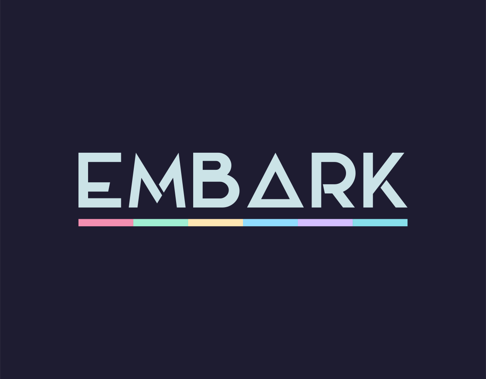
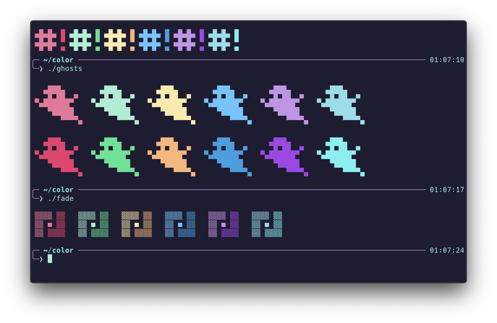

<p align="center"></p>

<p align="center"><strong>An ambitious iTerm theme.</strong></p>

<p align="center"><em>"Man cannot discover new oceans unless he has the courage to lose sight of the shore. - Andre Gide"</em></p>



## Getting Started

To install this theme in iTerm2, either clone this repository or simply download the `Embark.itermcolors` file. 

In iTerm2, navigate to `Preferences > Profiles > Colors > Color Presets` then select `Import...` to load the downloaded theme file.

### Other Terminals

If you use a terminal emulator other than iTerm2, you may find an equivalent port elsewhere in the Embark organization but for quick reference, the first 16 colors are as follows:

```
0  = #1E1C31
1  = #F0719B
2  = #A1EFD3
3  = #FFE9AA
4  = #57C7FF
5  = #C792EA
6  = #87DFEB
7  = #F8F8F2
8  = #585273
9  = #F02E6E
10 = #2CE592
11 = #FFB378
12 = #1DA0E2
13 = #A742EA
14 = #63F2F1
15 = #A6B3CC
```
